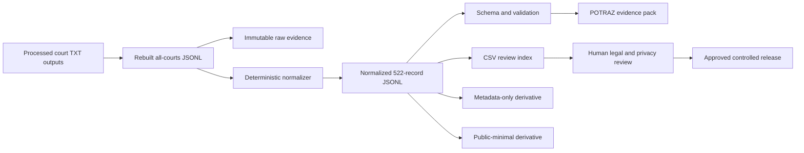

# Technical Architecture

The normalizer fills only blank values recoverable from preserved source blocks, derives machine fields, corrects division scope, and refreshes hashes. It does not rewrite substantive source text.
